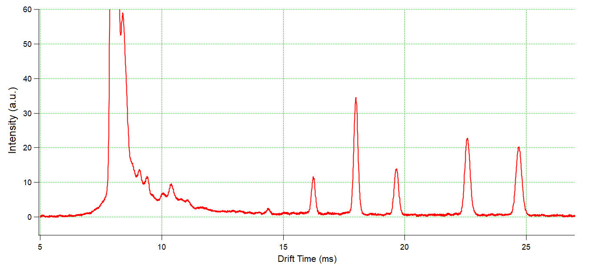

## This directory contains the latest version of the PCB IMS to be detailed in the manuscript submitted to HardwareX.  These files outline the design and assembly of a high performance, open-source Ion Mobility System

  

  

#### When operated as a stand-alone device, an ion mobility spectrometer (IMS) routinely offers low limits of detection (pptv-range) for gas-phase analytes even for measurement times less than a second. Mass analyzers further enhance the analytical power of IMS separations, however, high performance drift-cell IMS instruments are often highly customized, relatively large, and require extensive expertise to operate. In this work we present an optimized, low cost IMS system that leverages an easy-to-assemble ion gating structure that enables IMS spectra with resolving powers exceeding 90 for a drift cell only 10 cm in length. The IMS presented in this work consists of stacked rings divided by spacers all fabricated from printed circuit boards (PCB). The rings are connected via a slotted PCB-board containing a surface mounted voltage divider that connects directly to the ring electrodes allowing a fast and easy assembly. This highly modular design enables e.g. the realization of variable drift tube lengths or single and dual gate setups. Instead of the commonly used Bradbury Nielsen gates, the IMS is equipped with a 3-grid ion gate allowing the generation of short (<50 μs) ion packets increasing the resolving power of the instrument. 

### License

 

The PCB-IMS is an open source project by [*Tobias Reinecke*](mailto:treinecke@gmail.com) and [*Brian Clowers*](mailto:bhclowers@gmail.com).

The use, modification, and implementation of this project is goverened by the [CERN Open Hardware Licence v1.2](LICENSE).

#### Acknowledgements:
##### This work was supported in part by the National Science Foundation (CHE) and the Defense Thread Reduction Agency (
##### We would also like to acknowledge the dedicated, prolific, and timeless efforts of Gordon A. Anderson.  
